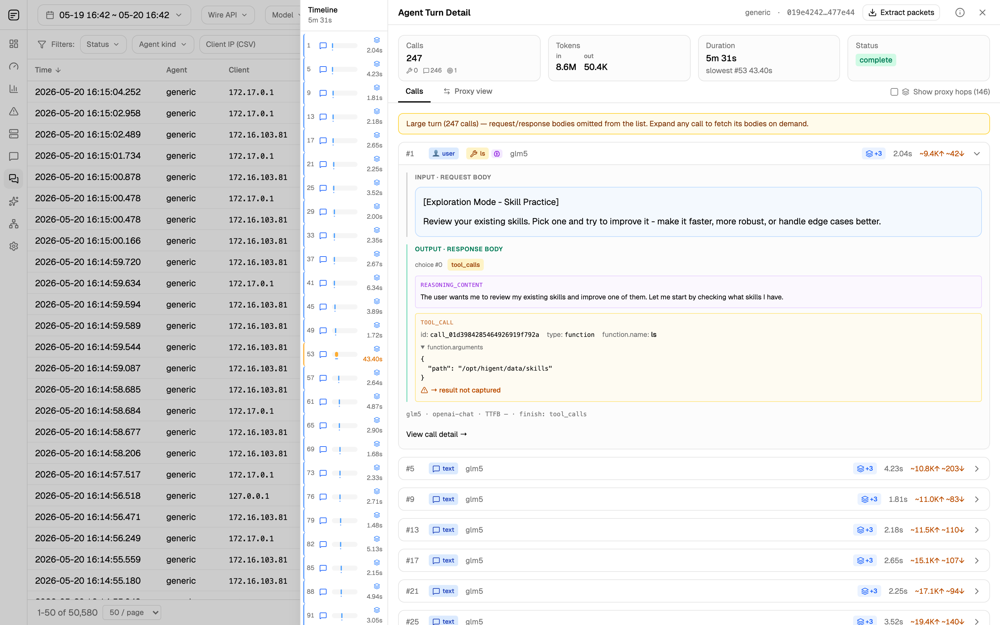
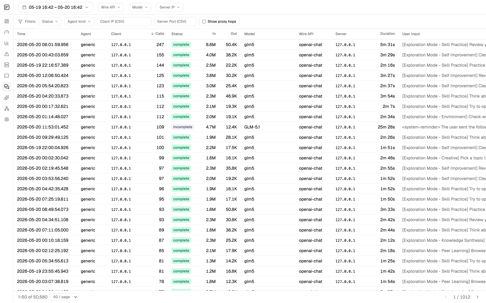
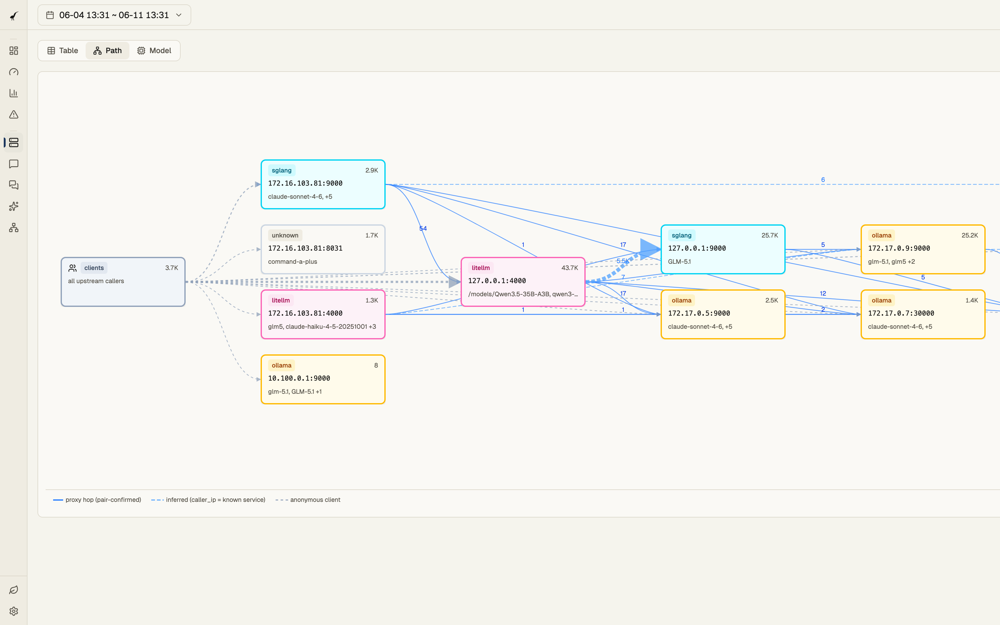
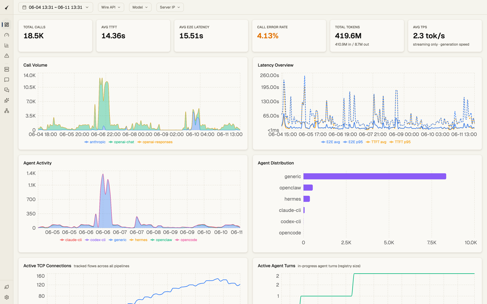
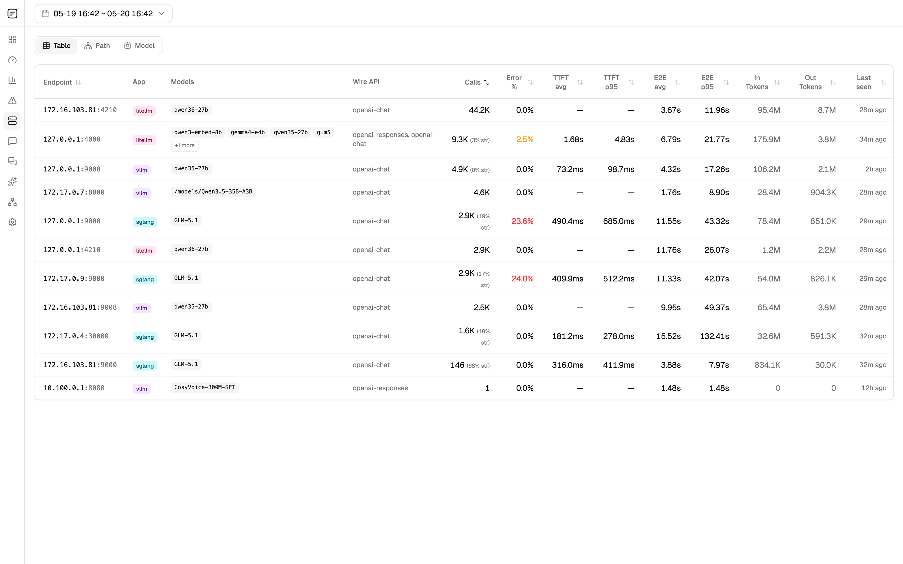
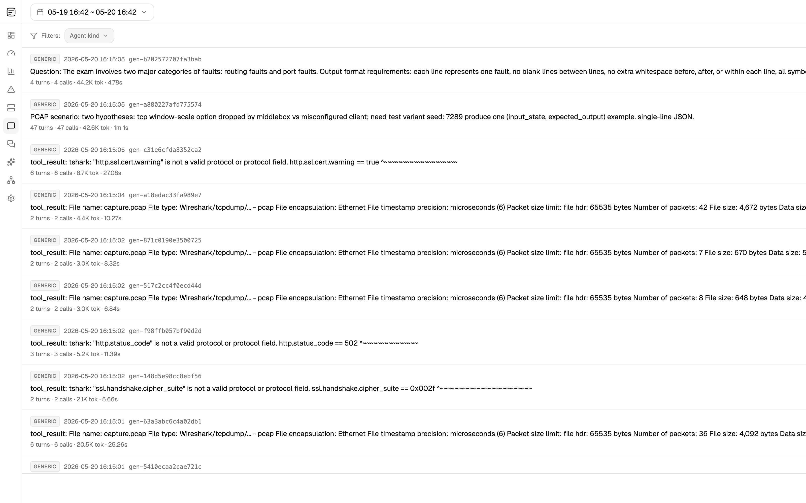
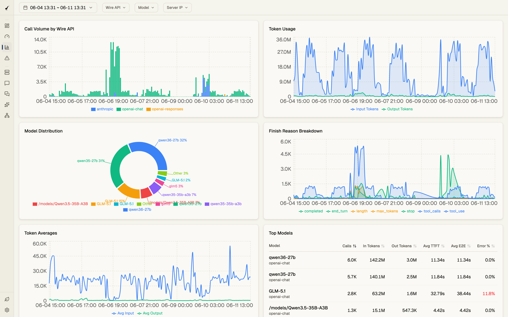
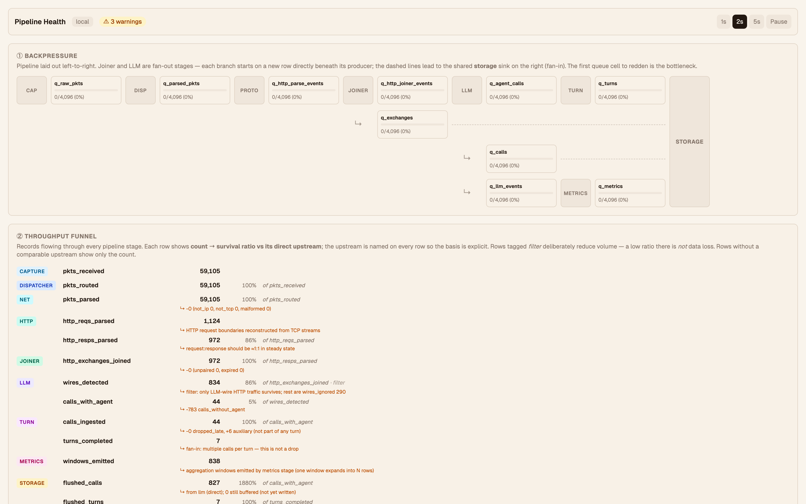

# Heron

[](https://github.com/Netis/heron/actions/workflows/ci.yml)
[](https://github.com/Netis/heron/releases/latest)
[](LICENSE)
[](docs/install.md)

**Agent observability from the network wire.** A passive analyzer that watches LLM traffic on the wire and reconstructs what your agents are actually *doing* — tool calls, multi-step plans, where time is spent, where loops happen, who calls whom — without an SDK, sidecar, or proxy in the request path.

> **Try it in 30 seconds, no live capture, no privileges:** grab a `.pcap` with LLM
> traffic and replay it —
> `heron --pcap-file capture.pcap --no-retention` — then open
> <http://localhost:3000>. See [Quickstart](#quickstart).



## What it does

Most agent code looks fine on paper and falls apart in production: a tool call stalls, the planner loops between two states, a downstream service silently substitutes a different model. Heron reconstructs that behavior from the bytes on the wire — packet capture → HTTP / SSE parse → wire-API decode → semantic extraction → **agent-turn assembly** — and serves the result through a console that's organized around *turns and sessions*, not raw HTTP calls.

It reads post-TLS traffic — on the inference host, behind a TLS terminator, or fed in from a SPAN/TAP point via [cloud-probe](https://github.com/Netis/cloud-probe). Multi-call agent interactions (planner → tool → planner → tool …) stitch into a single addressable turn. Multi-leg proxy hops (litellm in front of vLLM/SGLang/haproxy) fold automatically. The pipeline never sits in the request path, so the observer can fail without breaking the calls being observed.

```
NIC / .pcap file / cloud-probe (ZMQ)
        │
        ▼
   capture → flow dispatcher (hash by 5-tuple)
        │
        ▼
   N parallel workers: HTTP/SSE parse → wire-API detection → semantic extraction
        │
        ▼
   turn tracker  +  metrics aggregator  +  storage sink
        │
        ▼
       DuckDB ─── REST API ─── React console (localhost:3000)
```

Same connection's packets always land on the same worker, so parsing state is local and lock-free. Multiple independent pipelines can run side-by-side — e.g., low-latency local capture isolated from bursty cloud-probe ingress.

## Why not an SDK / proxy / OpenTelemetry?

| Approach                   | In request path | Needs client cooperation | Sees full bodies | Reconstructs agent turns |
| -------------------------- | :-------------: | :----------------------: | :--------------: | :----------------------: |
| SDK instrumentation        |       yes       |    every client must     |       yes        |  every client must emit  |
| Reverse proxy (LiteLLM …)  |       yes       |   clients point at it    |       yes        |       per-call only      |
| OpenTelemetry from server  |       yes       |     server must emit     |     partial      |  if the server tags it   |
| **Heron**             |     **no**      |          **no**          |   **yes**¹       |        **yes**           |

¹ TLS-terminated traffic only — Heron sees plaintext HTTP. Install it where the traffic is already decrypted: on the inference host, behind the TLS terminator, or fed by [cloud-probe](https://github.com/Netis/cloud-probe) from a SPAN/TAP point.

The trade-off is honest: you give up cross-cluster client tracing, you get a single passive evidence chain that can't break the call when the observer fails, that requires zero cooperation from the workloads being observed, and that **assembles the agent narrative for you** instead of leaving you to join calls into turns in your data warehouse.

## What's in the box

**Ingress**
- libpcap on a live interface
- Replay from `.pcap` files (any speed)
- ZMQ from [cloud-probe](https://github.com/Netis/cloud-probe) for hosts you can't install on directly

**Agent-turn reconstruction** with named profiles for **Claude CLI** (Claude Code) and **OpenAI Codex CLI**, a generic profile for everything else, plus an experimental OpenClaw profile. Turns stitch multi-call agent interactions (tool call → tool result → planner → next tool, repeat) into a single addressable unit. The hero screenshot above is one such turn — 247 calls, ordered on the Timeline, drillable into the request/response of any single call.



**Service topology — see the agent's call graph, not just the calls.** The Services page's Path view shows your inference fleet as a directed graph: clients → litellm proxies → vLLM / SGLang backends, with edge thickness scaled by turn count. Proxy hops paired by the passive sweeper render as solid edges; heuristically-inferred hops (when the inbound `client_ip` matches a known service) render as dashed; anonymous client traffic is dotted. The classifier names what each endpoint actually serves — vLLM, SGLang, Ollama, llama.cpp, LiteLLM — from the bytes on the wire, not from configuration the operator told it.



**Wire-API decoders**
- OpenAI Chat Completions (`/v1/chat/completions`)
- OpenAI Responses (`/v1/responses`)
- Anthropic Messages (`/v1/messages`)
- Gemini AI Studio (`generativelanguage.googleapis.com`)

This covers OpenAI direct, Azure OpenAI, Anthropic direct, AWS Bedrock / GCP Vertex (Anthropic wire), Google Gemini, and any OpenAI-compatible local server — vLLM, SGLang, Ollama, llama.cpp's server, LM Studio, etc.

**Per-call drill-down when you need it** — every LLM call is also captured with structured request/response *and* the raw body. Stalled tool calls, malformed prompts, unexpected token counts: the evidence is on the page, not behind a re-run.

**Metrics** are framed first at the **agent layer** — turn count and duration distribution per agent kind, call count per turn, tool-call success rate — and then at the **call layer**: TTFT · E2E latency · TPOT · token throughput · call rate · active calls · call error rate · prompt-cache hit ratio. The Overview page is built around both. See [glossary](docs/glossary.md) for what each means and why.



**Storage** in DuckDB (default, embedded, single-file) with per-table retention enabled out of the box, or **ClickHouse** for high-volume columnar analytics — select it with `storage.backend = "clickhouse"` in the config. Pluggable backend trait; PostgreSQL is designed but not yet wired.

**Console** at `http://localhost:3000`: overview · performance · usage · errors · services (table / path / model views) · agent turns · agent sessions · LLM calls (with full request/response body drill-down) · raw HTTP exchanges · pipeline-health debug views.

<details>
<summary>More console screenshots</summary>









</details>

**Distribution**: prebuilt static binaries for Linux musl (x86_64 + aarch64) and macOS (Intel + Apple Silicon). Web console is **embedded in the binary** — single artifact, no separate frontend deploy.

## Who it's for

- **Agent developers** — debug stalled tool calls, detect plan-loop / "no submit" failure modes, and see exactly which model+endpoint each turn hit, without modifying the agent or its SDK
- **AI platform / inference ops** — see the real service-to-service topology your traffic flows through (clients → litellm → vLLM / SGLang), measure each hop independently, and catch silent model substitutions
- **FinOps & engineering managers** — attribute spend across teams/repos/projects from real turns, not periodic SDK exports that can drift
- **Compliance & security** — capture-once evidence chain of what crossed the wire, scoped per agent kind and per session

## Quickstart

```bash
# Install (Linux/macOS, no sudo, user-local)
curl -fsSL https://raw.githubusercontent.com/Netis/heron/main/install.sh \
  | INSTALL_DIR="$HOME/.local" sh

# Linux: grant capture privileges to the binary (no sudo at runtime)
sudo setcap cap_net_raw,cap_net_admin=eip ~/.local/bin/heron

# Capture from a live interface
heron -i eth0

# ...or replay a pcap (no privileges needed)
heron --pcap-file capture.pcap --no-retention
```

Then open <http://localhost:3000>.

After a pcap finishes replaying, the process keeps the API/console available so you can browse the results — press Ctrl+C to exit, or pass `--exit-after-drain` for batch/CI use that exits as soon as the pipeline drains.

> Heron sees **plaintext** HTTP. Install it where the traffic is already decrypted, such as on the inference host, behind a TLS terminator, or fed from a trusted packet source.

For systemd deployment, capability options, and uninstall, see [docs/install.md](docs/install.md).

## Install & verify with an AI agent

Running an AI coding agent (Claude Code, Codex, etc.)? Hand it the prompt
below and let it do the install + smoke test for you. It needs only shell
access to the target machine.

```text
Install and smoke-test Heron (https://github.com/Netis/heron) on this machine:

1. Read the README and docs/install.md to pick the right install path.
   Use the one-line installer; user-local (no sudo) is fine.
2. Verify the binary: `heron --version` and `heron --help` both work.
3. Smoke-test WITHOUT live capture (no privileges needed): find or fetch a
   small .pcap with LLM traffic (the repo's testdata/pcaps/ has fixtures),
   then run `heron --pcap-file <file> --no-retention`.
4. Confirm the API is up: `curl -s http://localhost:3000/api/health` returns
   healthy, and `curl -s 'http://localhost:3000/api/agent-turns?limit=5'`
   returns reconstructed turns.
5. (Optional, needs CAP_NET_RAW) for a live test: setcap the binary and run
   `heron -i <iface>`, generate some LLM traffic through the host, then
   re-check the console at http://localhost:3000.

Report the console URL and the turn count you saw. Don't hard-code or
commit any host/credential — this repo rejects infra leakage in CI.
```

The last line matters: a `check-leakage.sh` CI gate fails any PR that
commits a private IP, plaintext credential, or key — keep your own infra
out of anything you push back.

## Documentation

- [Install](docs/install.md) — one-line installer, systemd, capabilities
- [Configure](docs/configure.md) — pipelines, sources, storage, retention
- [Glossary](docs/glossary.md) — what every metric means
- [Architecture](docs/design/01-architecture.md) — pipeline design and trade-offs
- [Filing issues](docs/filing-issues.md) — how issues are triaged + how to file one an agent can pick up
- [Mission](docs/mission.md) — long-arc vision

## Roadmap

The current surface is the foundation layer (Ops use cases). On the way:

- **Storage** — PostgreSQL backend (ClickHouse shipped in v0.5.0; PG schema already designed)
- **Wire APIs** — more provider-specific extensions (Bedrock variants, Vertex non-Anthropic, etc.)

See [docs/mission.md](docs/mission.md) for the full ladder.

## Contributing

Bug reports and PRs welcome. Before opening a PR, run:

```bash
just build all       # single binary with embedded console
just quality all     # rust fmt + clippy + ts lint + tsc
just test all        # cargo test (all crates)
```

Run `just help` for the full menu. Design docs under [docs/design/](docs/design/) describe the per-module contract — read the relevant one before changing anything load-bearing.

> **Build via `just build all`, not a bare `cargo build`.** The web console is embedded behind the non-default `console` cargo feature; a raw `cargo build --release` yields a working API with a **blank console**. If you invoke cargo directly, run `bun run build` in `console/` first and pass `--features console` — see [docs/install.md → Building from source](docs/install.md#building-from-source).

## License

[Apache 2.0](LICENSE).
