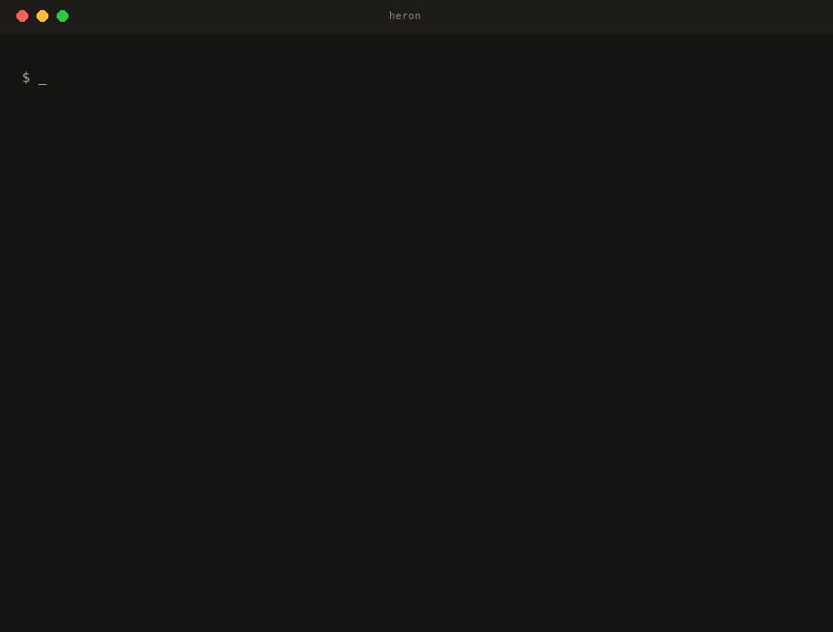

# Heron

**The Wireshark for AI Agents**

Passive agent observability — reconstructed from the traffic itself, off the wire
or at the host's TLS boundary, never in the request path.

[](https://github.com/Netis/heron/actions/workflows/ci.yml)
[](https://github.com/Netis/heron/releases/latest)
[](LICENSE)
[](docs/install.md)

> **Zero SDK. Zero Proxy. Zero Intrusion.**
> Replay a `.pcap` and instantly see every agent turn, tool call, and LLM
> interaction. No code changes. No cooperation from the workloads being observed.

<p align="center">
  
</p>

<p align="center">
  <em>One command. 247 calls → 12 agent turns. Every tool call visible. <a href="#30-second-quick-start">Try it now ↓</a></em>
</p>

---

## 30-Second Quick Start

No live capture needed. No privileges. Just a `.pcap` with LLM traffic.

```bash
# Install (Linux/macOS, user-local, no sudo)
curl -fsSL https://raw.githubusercontent.com/Netis/heron/main/install.sh \
  | INSTALL_DIR="$HOME/.local" sh

# Replay a pcap — no privileges needed
heron --pcap-file capture.pcap --no-retention
```

Open <http://localhost:3000> to see your agent turns, timelines, and metrics.
After a pcap finishes replaying, the process keeps the API/console available so
you can browse — press Ctrl+C to exit, or pass `--exit-after-drain` for batch/CI
use that exits as soon as the pipeline drains.

> **No pcap handy?** The repo ships fixtures in [`testdata/pcaps/`](testdata/pcaps/) — replay any of them.
> **Have a live interface?** Run `heron -i eth0` (needs `CAP_NET_RAW` on Linux — see [install docs](docs/install.md)). Grant it once with `sudo setcap cap_net_raw,cap_net_admin=eip ~/.local/bin/heron` so no sudo is needed at runtime.
> **On Linux?** An experimental on-host [eBPF source](docs/design/02-capture.md#ebpf-ssl-uprobe-capture-linux-experimental) reads TLS-encrypted traffic as plaintext at the in-process `SSL_read`/`SSL_write` boundary, attributed per process — opt-in, built behind the `ebpf` cargo feature, needs `CAP_BPF`.

> Heron sees **plaintext** HTTP. Install it where the traffic is already
> decrypted: on the inference host, behind the TLS terminator, or fed from a
> trusted packet source.

---

## What Makes Heron Different

<table>
<tr>
<td width="33%" valign="top">

### Agent Turn Reconstruction

Stitches multi-call agent interactions (planner → tool → result → next tool)
into **single addressable turns** — see the full agent narrative, not raw HTTP
calls.

Named profiles for **Claude Code** and **OpenAI Codex CLI**, plus a generic
profile for everything else.


</td>
<td width="33%" valign="top">

### Service Topology

See your inference fleet as a **directed graph**: clients → litellm proxies →
vLLM / SGLang backends, edge thickness scaled by turn count.

Heron classifies what each endpoint serves — vLLM, SGLang, Ollama, llama.cpp,
LiteLLM — **from the bytes on the wire**, not from configuration.


</td>
<td width="33%" valign="top">

### SFT Trajectory Export

**Turn real agent traffic into fine-tuning data.** Export any turn or session
as OpenAI-style `messages` JSONL — tool calls, results, and reasoning preserved,
arguments rehydrated to objects.

One click from a turn's detail view, or batch-export from the Agent Turns list
with the current filter (time · agent kind · model · wire API). Anthropic and
OpenAI-chat wire formats today; unsupported formats are reported and skipped,
not failed.

</td>
</tr>
</table>

---

## Why Not an SDK / Proxy / OpenTelemetry?

| Approach | In request path | Needs client changes | Sees full bodies | Reconstructs turns | Exports SFT data |
| --- | :---: | :---: | :---: | :---: | :---: |
| SDK instrumentation | yes | every client | yes | manual | manual |
| Reverse proxy (LiteLLM …) | yes | re-point clients | yes | per-call only | no |
| OpenTelemetry from server | yes | server must emit | partial | if tagged | no |
| **Heron** | **no** | **none** | **yes**¹ | **automatic** | **one click** |

¹ TLS-terminated traffic — Heron sees plaintext HTTP. Install it where the
traffic is already decrypted (inference host, behind the TLS terminator, or fed
by [cloud-probe](https://github.com/Netis/cloud-probe) from a SPAN/TAP point),
or use the experimental Linux [eBPF source](docs/design/02-capture.md#ebpf-ssl-uprobe-capture-linux-experimental)
for on-host encrypted capture with per-process attribution.

The trade-off is honest: you give up cross-cluster client tracing. You get a
single passive evidence chain that can't break the call when the observer fails,
requires zero cooperation from the workloads being observed, and **assembles the
agent narrative for you** instead of leaving you to join calls into turns in your
data warehouse.

---

## Architecture

```
NIC / .pcap file / cloud-probe (ZMQ) / eBPF SSL uprobes
        │
        ▼
   capture → flow dispatcher (hash by 5-tuple)
        │
        ▼
   N parallel workers: HTTP/SSE parse → wire-API detection → semantic extraction
        │
        ▼
   turn tracker  +  metrics aggregator  +  storage sink
        │
        ▼
       DuckDB ─── REST API ─── React console (localhost:3000)
```

Same connection's packets always land on the same worker, so parsing state is
local and lock-free. Multiple independent pipelines can run side-by-side — e.g.
low-latency local capture isolated from bursty cloud-probe ingress. The pipeline
never sits in the request path, so the observer can fail without breaking the
calls being observed.

> **On-host eBPF capture (Linux, experimental).** Packet capture only sees
> plaintext. Heron's eBPF SSL-uprobe source lifts that on Linux: it hooks
> `SSL_read` / `SSL_write` in-process and reads **TLS-encrypted** LLM calls as
> plaintext *on the host that makes them* — no proxy, no TLS terminator, no SDK,
> never in the request path — and stamps every call with its **owning process**
> (pid · command · executable). It covers dynamically-linked OpenSSL/BoringSSL
> (Python `openai`/`anthropic` SDKs, curl, Node, most CLIs) and statically-linked,
> symbol-stripped BoringSSL single-executable runtimes (Claude Code's and
> opencode's Bun binaries, located by byte-signature offset). It follows the
> agent CLIs' frequent npm self-updates (re-attaches across the rotated binary
> inode) and reaches already-running sessions (via `/proc/<pid>/exe`) without a
> restart. Opt-in — built behind the `ebpf` cargo feature; needs `CAP_BPF` +
> kernel BTF. See [eBPF capture](docs/design/02-capture.md#ebpf-ssl-uprobe-capture-linux-experimental).

---

## What's in the Box

<details>
<summary><strong>Ingress sources</strong></summary>

- **libpcap** on a live interface
- **Replay** from `.pcap` files (any speed)
- **ZMQ** from [cloud-probe](https://github.com/Netis/cloud-probe) for hosts you can't install on directly
- **eBPF SSL uprobes** (Linux · opt-in) — hook `SSL_read` / `SSL_write` in-process to read TLS-encrypted traffic as plaintext on the host that makes the calls, with no proxy or TLS terminator, and stamp every call with its owning process. Covers dynamically-linked OpenSSL/BoringSSL and statically-linked, symbol-stripped BoringSSL runtimes (Claude Code's / opencode's Bun). Built behind the `ebpf` cargo feature, needs `CAP_BPF`. See [eBPF capture](docs/design/02-capture.md#ebpf-ssl-uprobe-capture-linux-experimental).

</details>

<details>
<summary><strong>Wire-API decoders</strong></summary>

- OpenAI Chat Completions (`/v1/chat/completions`)
- OpenAI Responses (`/v1/responses`)
- Anthropic Messages (`/v1/messages`)
- Gemini AI Studio (`generativelanguage.googleapis.com`)

Covers OpenAI direct, Azure OpenAI, Anthropic, AWS Bedrock / GCP Vertex
(Anthropic wire), Google Gemini, and any OpenAI-compatible server — vLLM, SGLang,
Ollama, llama.cpp, LM Studio, etc. Every LLM call is also captured with
structured request/response **and** the raw body, so stalled tool calls,
malformed prompts, and unexpected token counts are evidence on the page, not
behind a re-run.

</details>

<details>
<summary><strong>Console pages</strong></summary>

`http://localhost:3000` — Overview · Performance · Usage · Errors · Services
(table / path / model) · Agent Turns · Agent Sessions · LLM Calls (with full
request/response drill-down) · Raw HTTP · Pipeline Health.

Three themes, one toggle: **Kami** (`紙神` — warm washi-paper, the default and
what the screenshots show), **Dark** (slate), **Light** (high-contrast). The
choice persists per browser; charts, the topology graph, and the timeline gantt
all re-theme with it.

</details>

<details>
<summary><strong>Metrics</strong></summary>

- **Agent layer:** turn count and duration distribution per agent kind, call count per turn, tool-call success rate.
- **Call layer:** TTFT · E2E latency · TPOT · token throughput · call rate · active calls · error rate · prompt-cache hit ratio.

See the [glossary](docs/glossary.md) for what each means and why.

</details>

<details>
<summary><strong>Storage &amp; distribution</strong></summary>

- **Storage:** DuckDB (default, embedded, single-file) with per-table retention out of the box, or **ClickHouse** for high-volume columnar analytics (`storage.backend = "clickhouse"`). Pluggable backend trait; PostgreSQL is designed but not yet wired.
- **Distribution:** prebuilt static binaries for Linux musl (x86_64 + aarch64) and macOS (Intel + Apple Silicon). The web console is **embedded in the binary** — single artifact, no separate frontend deploy.

</details>

---

## Who It's For

| Role | Use case |
| --- | --- |
| **Agent developers** | Debug stalled tool calls, detect plan-loop / "no submit" failures, see exactly which model+endpoint each turn hit — without modifying the agent or its SDK |
| **AI platform / inference ops** | See the real service-to-service topology (clients → litellm → vLLM / SGLang), measure each hop, catch silent model substitutions |
| **FinOps & eng managers** | Attribute spend across teams/repos/projects from real turns, not periodic SDK exports that drift |
| **Compliance & security** | Capture-once evidence chain of what each agent sent and received, scoped per agent kind and session |
| **Model trainers / fine-tuners** | Turn real captured agent runs into SFT datasets — per turn or whole session — without hand-labeling or re-running the agent |

---

## Install & Verify with an AI Agent

Running an AI coding agent (Claude Code, Codex, etc.)? Hand it the prompt below
and let it do the install + smoke test. It needs only shell access to the target
machine.

```text
Install and smoke-test Heron (https://github.com/Netis/heron) on this machine:

1. Read the README and docs/install.md to pick the right install path.
   Use the one-line installer; user-local (no sudo) is fine.
2. Verify the binary: `heron --version` and `heron --help` both work.
3. Smoke-test WITHOUT live capture (no privileges needed): find or fetch a
   small .pcap with LLM traffic (the repo's testdata/pcaps/ has fixtures),
   then run `heron --pcap-file <file> --no-retention`.
4. Confirm the API is up: `curl -s http://localhost:3000/api/health` returns
   healthy, and `curl -s 'http://localhost:3000/api/traces?limit=5'` returns
   reconstructed traces.
5. (Optional, needs CAP_NET_RAW) for a live test: setcap the binary and run
   `heron -i <iface>`, generate some LLM traffic through the host, then
   re-check the console at http://localhost:3000.

Report the console URL and the trace count you saw. Don't hard-code or commit
any host/credential — this repo rejects infra leakage in CI.
```

The last line matters: a `check-leakage.sh` CI gate fails any PR that commits a
private IP, plaintext credential, or key — keep your own infra out of anything
you push back.

---

## Documentation

| Doc | Description |
| --- | --- |
| [Install](docs/install.md) | One-line installer, systemd, capabilities, uninstall |
| [Configure](docs/configure.md) | Pipelines, sources, storage, retention |
| [eBPF capture](docs/design/02-capture.md#ebpf-ssl-uprobe-capture-linux-experimental) | On-host TLS capture + process attribution (Linux, opt-in) |
| [Architecture](docs/design/01-architecture.md) | Pipeline design and trade-offs |
| [Glossary](docs/glossary.md) | What every metric means |
| [Filing issues](docs/filing-issues.md) | How issues are triaged + how to file one an agent can pick up |
| [Mission](docs/mission.md) | Long-arc vision |
| [Changelog](CHANGELOG.md) | Release history |

---

## Roadmap

The current surface is the foundation layer (Ops use cases). On the way:

- **Storage** — PostgreSQL backend (ClickHouse shipped in v0.5.0; PG schema already designed)
- **Wire APIs** — more provider-specific extensions (Bedrock variants, Vertex non-Anthropic, etc.)

See [docs/mission.md](docs/mission.md) for the full ladder.

---

## Contributing

Bug reports and PRs welcome. Before opening a PR, run:

```bash
just build all       # single binary with embedded console
just quality all     # rust fmt + clippy + ts lint + tsc
just test all        # cargo test (all crates)
```

Run `just help` for the full menu. Design docs under [docs/design/](docs/design/)
describe the per-module contract — read the relevant one before changing anything
load-bearing.

> **Build via `just build all`, not a bare `cargo build`.** The web console is
> embedded behind the non-default `console` cargo feature; a raw
> `cargo build --release` yields a working API with a **blank console**. If you
> invoke cargo directly, run `bun run build` in `console/` first and pass
> `--features console` — see [docs/install.md → Building from source](docs/install.md#building-from-source).

---

## License

[Apache 2.0](LICENSE).
